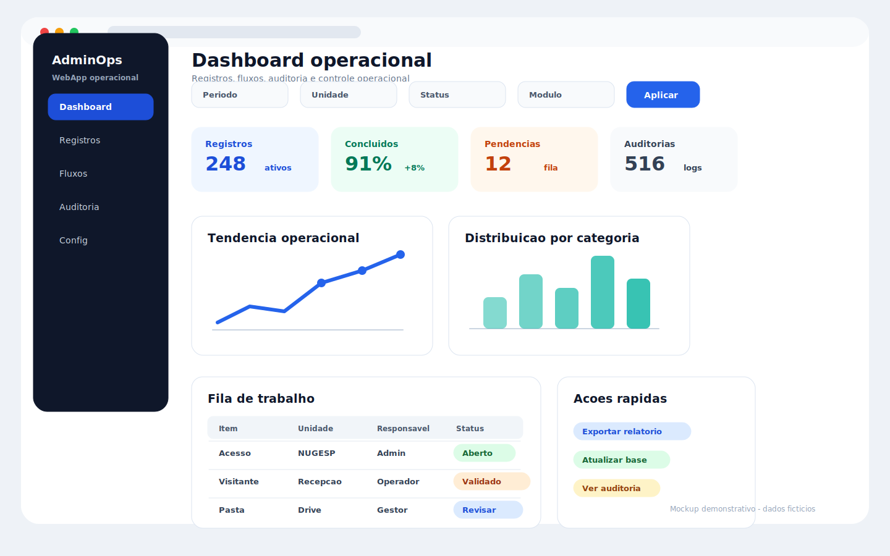
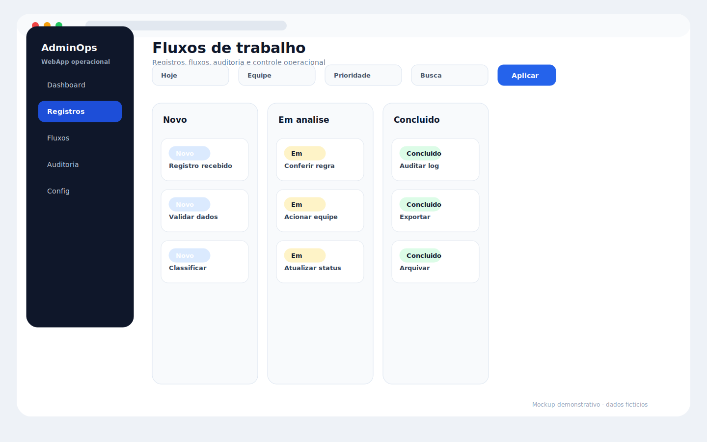
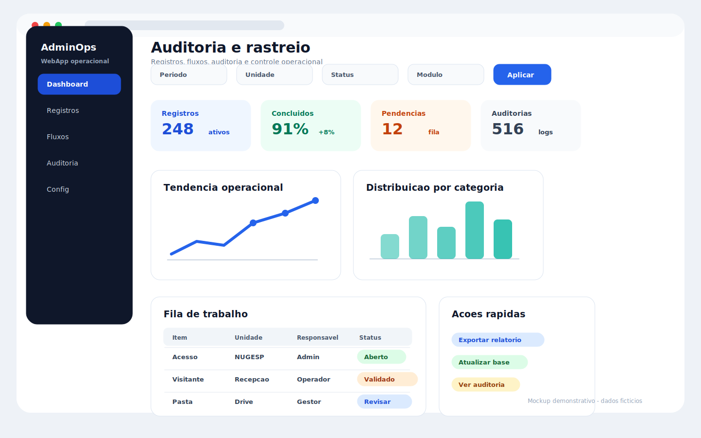

# Administrative Workflow System

Administrative system for managing records, workflows, and operational information.

## Overview

This project was developed to solve real operational problems using web technologies and Google Workspace tools.

## Features

- Dashboard interface
- Process automation
- Data organization
- KPI monitoring
- Responsive design
- Google Workspace integration

## Technologies

- JavaScript
- HTML
- CSS
- Google Apps Script
- Google Sheets
- Looker Studio

## Purpose

The goal of this project is to improve operational efficiency, reduce manual work, and support better decision-making through automation and clear data visualization.

## Guia visual do sistema

> Mockups demonstrativos do sistema, com dados ficticios e sem informacoes reais de pacientes ou da instituicao.

### Dashboard operacional

### Fluxos de trabalho

### Auditoria e rastreio

## Status

Completed